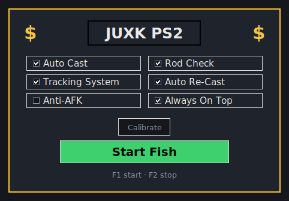

# Project-Slayer-2-Fishing-Mango
Fishing overnight — **JUXK PS2** fishing macro for Project Slayer 2 (Roblox, Windows).

It only reads the screen (colour tracking) and presses the mouse, like a person would.
No injection, no memory reading.



## What it does
1. **Rod Check** – waits until your fishing rod is held (checks one pixel you pick).
2. **Auto Cast** – holds left click to cast.
3. **Tracking System** – waits for the reel bar, then holds/releases click so your
   bar stays on the fish until the minigame ends.
4. **Auto Re-Cast** – starts over. Recasts by itself if nothing bites in 30s.

## Get the exe
- **Download:** GitHub → **Actions** → latest **Build exe** run → **Artifacts** →
  `JUXK-PS2-exe` (a zip with `JUXK-PS2.exe` inside). Every push builds a new one.
- **Or build it yourself** (needs [Python 3.10+](https://www.python.org/downloads/),
  tick *Add to PATH*): double-click `build_exe.bat` → `dist\JUXK-PS2.exe`.
- **Or run without an exe:** double-click `run.bat`.

Windows SmartScreen may warn because the exe isn't signed: *More info → Run anyway*.

## Setup
1. Open `JUXK-PS2.exe` (it saves `config.json` next to itself).
2. In Roblox, equip your rod and start fishing once so the reel bar is on screen.
3. Click **Calibrate**:
   - **Reel bar region → Select**: drag a box tightly around the reel bar.
   - **Fish colour → Pick**: hover the fish/target marker for 3 seconds.
   - **Your bar colour → Pick**: hover the bar you move for 3 seconds.
   - **Rod-held pixel → Pick**: hover a spot that only looks that way while the rod
     is held (e.g. the highlighted rod hotbar slot). Skip it and turn off Rod Check
     if you don't need it.
   - **Save**.
4. Click **Start Fish** or press **F1**. **F2** stops.

Settings are saved to `config.json`.

## Tuning
- Bar not detected → raise *Colour tolerance* (25 → 40) or re-pick the colours.
- Cast too short/long → change *Cast hold (s)*.
- Bar wobbles around the fish → in `config.json` raise `deadzone`;
  bar overshoots → raise `lookahead` a little (0.08 → 0.12).
- Use windowed/fullscreen consistently; moving the window means re-selecting the region.

## Tests
```
pip install numpy pytest
python -m pytest tests
```
The tests run the fishing loop against a simulated reel minigame.

Macros can break Roblox / game rules — use at your own risk.
